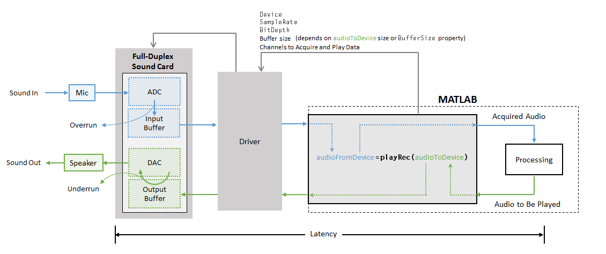
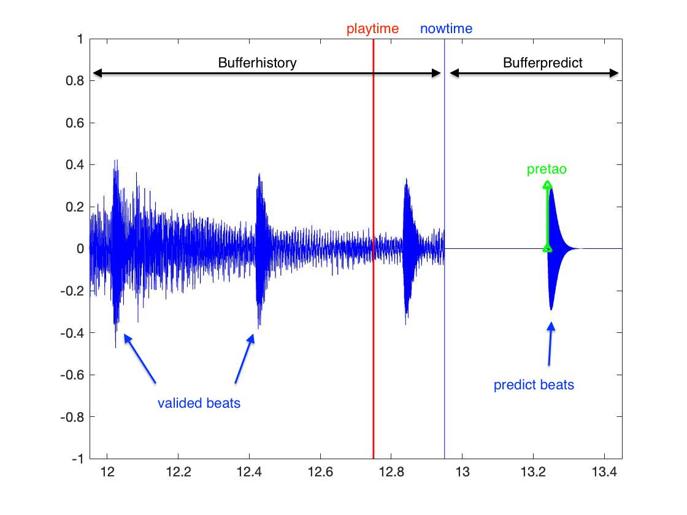
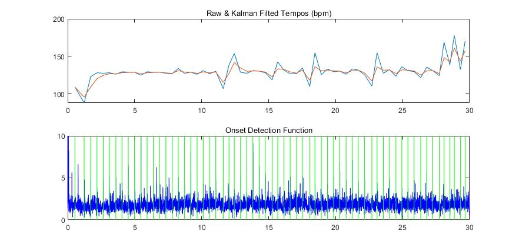
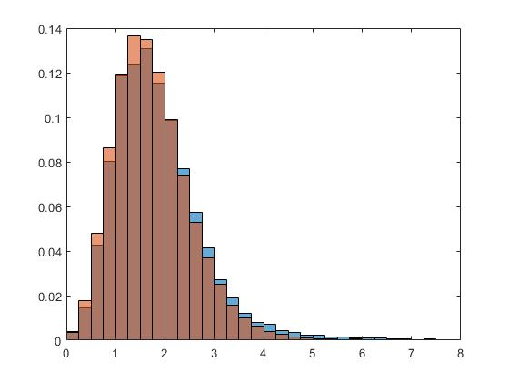

# Online Beat Tracking Based on  Kalman Filter 基于卡尔曼滤波的在线节拍跟踪器（Matlab）

## 概述

目前搭建好卡尔曼滤波器，使用 AudioToolbox 可从文件或者设备读取音频流，放进 Buffer 内做重音（Onset）检测，作为卡尔曼滤波器的输入，得到新的估计，实现了在线的节拍跟踪和估计。拍位置的观测方法为局部最大值规则（LocalMax），但是测量不准确，丢拍、错拍概率很高，目前还未统计正确率和最长持续跟踪时间。

主文件为```beattrack.m```, 运行之前需要设置音频I/O设备或者文件路径。

## 音频流 I/O 函数

使用matlab内置音频工具箱AudioToolbox的函数实现

**dsp.AudioFileReader** | **dsp.AudioFileWriter** | **audioDeviceReader** | **audioDeviceWriter**

具体参考官方手册: [Audio I/O: Buffering, Latency, and Throughput](https://ww2.mathworks.cn/help/audio/gs/audio-io-buffering-latency-and-throughput.html).



需要设置的参数有一次采样率*sr*，读取的音频长度*readtime*，输入、输出*Device/Filename*，*Device*可以使用 [getAudioDevices( )](https://ww2.mathworks.cn/help/audio/ref/audioplayerrecorder.getaudiodevices.html)获取。

注意: 同时拾音和收音需要考虑音频串流的问题，目前在MAC上可以用**虚拟声卡软件**Loopback提取音轨，Windows系统上还没找到比较好的解决方案。

## 添加一个处理Buffer

由于“**音频读取--处理--估计--播放**”循环存在延迟，因此验证拍永远落后于实际音频播放的时间。设置一个处理Buffer，长度由历史缓存```bufferhistory```和预估缓存```bufferpredict```构成。历史缓存```bufferhistory```用于重音观测，预估缓存```bufferpredict```用于放置和播放预估得到的拍子。

Buffer随着歌曲进行向前推移，可与通过卡尔曼滤波或自相关运算获得的预估拍，再经LM观测得到新的验证拍，如此递归运算。



## 对 ```tempo()``` 的一些修改

```tempo()``` 是**coversongsID**给出的预处理函数，功能有：计算梅尔频谱```D```、给出重音检测函数```onsetenv```、检测函数的自相关运算```xcr```，以及根据自相关运算结果给出2个候选速度```startpd```,```startpd2```。

```tempo()``` 给出的```onsetenv```经过dc-remove滤波，去掉这个filter以后,增加了```p=3```的均值滤波，得到正常的重音检测函数```df```。在Buffer内绘制出```df```,观测后发现主要是存在休止符和**Non-Beat Onset**干扰的问题，导致卡尔曼滤波效果不稳定。

最后添加了整首歌曲在Kalman滤波前、后的节拍周期```obvtempos```,```filttempos```的对比曲线。



## 局部最大值规则（LM）

使用局部最大值规则观测拍子位置，观测窗口位置是预估拍```pretao```，窗口宽度```W```为50%预估节拍周期长度```0.5*predelta```，于是，当```nowtime```超过```pretao+w/2```时进行一次LM，得到的拍子位置观测值```obvtao```放入卡尔曼滤波进行估计。

``` matlab
b = KalmanFilter(obvtao);
```

## 卡尔曼滤波器

将节拍进行描述为一个动态线性系统，其具有两个状态变量：拍子位置```tao```和节拍周期```delta```以及对应的协方差```P```，并加入过程噪声```Q```和观测噪声```R```,于是卡尔曼滤波器实现如下：

``` matlab
% KalmanFilter.m
persistent A M Q R x P

% Predict
xp = A * x;

Pp = A * P * A' + Q;

% Update
K = Pp * M' / ( M * Pp * M' + R);

x = xp + K * (y - M * xp);

P = Pp - K * M * Pp;   
```

## 可选择的播放位置

我们可以选择播放Buffer内任意位置的音频，通过一个延迟参数```playdelay```来实现，其含义为播放时间```playtime```是当前时间```nowtime```延迟```playdelay```秒。

如果```playdelay```设置为大于```W```，则播放的为已验证的拍和音乐，如果 ```playdelay```小于0, 则播放的是预估的拍子，但没有音乐，其中```W```是验证窗口，长度为20%～30%的节拍周期。如果在```W```验证窗口内播放，可能会同时听到估计拍和观测拍的声音。

利用```playdelay```可以提前将预估拍子播放出来，抵消掉音频处理系统的“**音频读取--处理--估计--播放**”循环的延迟，实现在线节拍跟踪，提前的时间可能需要根据不同的处理系统具体测量，目前根据效果手动指定为0.2s。

## 概率数据关联(PDA)   （开发中·····）

PDA算法用概率的方法同时讨论所有观测到的候选拍。理想情况下，PDA能拾取所有目标观测值，并丢弃随机噪声和干扰引起的其他测量值。

PDA算法分为两步：

一、验证测量值：限制了测量值选取的范围，减少候选拍。由于参数复杂，手动选定一个观测区域，为估计拍周围20%的节拍周期长度的区间。

   确定验证区域后，下一步是进行概率数据关联（或叫概率数据加权）。每一次采样时，都会计算一次测量验证空间，如果落入测量空间的候选测量值不止一个，那么就对所有候选测量值进行PDA。

二、关联测量值(PDA)：将候选的测量值与目标关联起来，获得一个更准确的测量值。

假定状态变量服从高斯分布，修改卡尔曼滤波算法，将测量残差修改为概率加权残差。引入多个观测候选值```y```和对应的权值系数```bta```，对卡尔曼滤波算法修改如下:

``` matlab
% KalmanFilterPDA.m
bta0 = bta(1); % Probribility of no beat obvsered in the window.

bta(1) =[]; % Probribility of the candidate beat is beat note.

% Predict
xp = A * x;

Pp = A * P * A' + Q;

% Update
K = Pp * M' / ( M * Pp * M' + R);

x = xp + K * sum((y - M * xp) .* bta);

P0 = ( eye(2) - K * M ) * Pp;

yh = y - M * xp;

Ph = K * ( sum( bta * (yh * yh') ) - yh * yh' )  * K';

P = bta0 * Pp + (1 - bta0) * P0 + Ph;  
```

权值系数```bta```计算方式如下：

假设验证区域中有多个候选拍，对于其中某个候选拍k为真实拍的概率可以分两部分计算。

*No.1* 一如卡尔曼滤波器假设，估计拍的分布是一个均值估计位置```pretao```,方差```P(1,1)```的高斯分布

``` matlab
pdf = normpdf( window, pretao, sqrt(P(1,1)))
```

则某一候选拍为真实拍的的概率就是其位置在此高斯分布上的**位置概率**```ploc```，显然```ploc```与测量残差高度相关。

*No.2* 使用已标注的数据集，统计检测函数上重音强度(Beat Intensity)和非重音强度(Non-Beat Intensity)的概率分布，则根据候选拍的重音强度可以在分布上取得其为真实拍的概率```pb```,和其他候选拍不是真实拍的概率值```pn1```, ```pn2```... 于是该候选拍的**强度概率**```pints```为

``` matlab
pints = pb·pn1·pn2...
```

综合上述两项概率，则该候选拍为真实拍的概率为：

``` matlab
pk = ploc * pints;
```

那么所有候选拍的概率可以确定了，这就是他们的权值：```bta(1)```, ```bta(2)```...

再根据贝叶斯概率公式计算出所有候选拍都不是真实拍的概率```bta0```, 并加入权值系数```bta```中：

``` matlab
bta0 = 1 - prod(bta);

bta = [bta0, bta];
```

### 统计强度概率分布

根据PDA的要求，我们需要一个先验的候选拍真实与否关于重音强度的概率分布。使用MIREX06数据集，其包含20段长度30s的音频```trainX.wav```，每一段都由40个测试人员分析其节拍，文件```trainX.txt```记录了拍子的位置。

测试人员给出的拍子将作为基本真值（gound truth），对真实拍子的重音强度进行统计，得到如下直方图（蓝色是节拍音的分布，橙色是非节拍音）：



可见两者无明显差异，且和文献相去甚远：


分析数据集，可见基本真值的分布较为分散，并不准确落在重音拍上。

.jpg)

那么接下来的工作有三个选择：

1. 手工把基本真值定位到重音上，但是较为繁琐；
2. 修改检测函数使其更平滑，但是损失高频细节；
3. 直接采用文献给出的概率分布；
